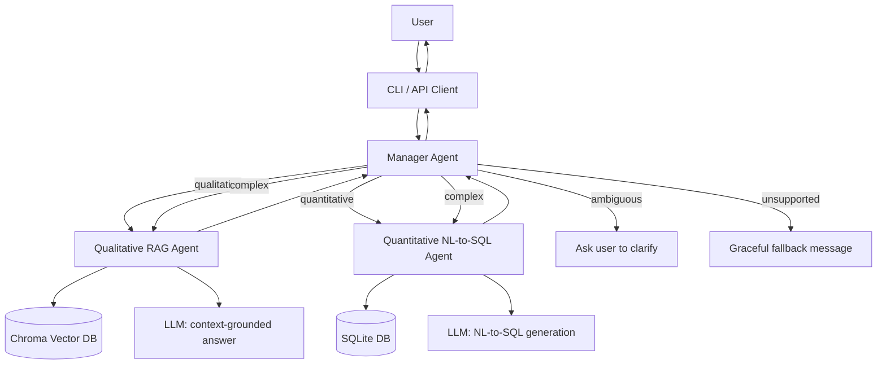

# Multi-Agent RAG System for Enterprise Documentation

A Python-based multi-agent system that answers enterprise documentation questions end-to-end. A Manager agent classifies each incoming query and routes it to a **Qualitative RAG agent** (semantic document search), a **Quantitative NL-to-SQL agent** (structured data queries), or both, merging their answers when a question needs information from both sources. The system is accessible via a command-line interface and a FastAPI HTTP API.

---

## Table of Contents

- [Architecture](#architecture)
- [Agent Roles](#agent-roles)
- [Setup](#setup)
- [Usage — CLI](#usage--cli)
- [Usage — API](#usage--api)
- [Testing](#testing)
- [Logging](#logging)
- [Known Limitations](#known-limitations)

---

## Architecture



**Query classification logic:**

| Query Type | Trigger | Behavior |
|---|---|---|
| Qualitative | Policy/process keywords ("policy", "explain", "how do we") | Routed to the RAG agent only |
| Quantitative | Metric keywords ("revenue", "churn", "compare", "trend") | Routed to the SQL agent only |
| Complex | Both qualitative and quantitative signals present | Both agents run; responses merged and labeled |
| Ambiguous | Vague terms ("performance", "results") with no clear signal | Neither agent is called; user is asked to clarify |
| Unsupported | No matching signals at all | Graceful fallback message; no agent is called |

---

## Agent Roles

### Manager Agent (`agents/manager.py`)
Classifies each query, routes it to the correct agent(s), merges and labels responses for complex queries, and asks a clarifying question for ambiguous queries instead of guessing. Logs the incoming query, the selected agent, and total execution time for every request.

### Qualitative RAG Agent (`agents/qualitative_agent.py`)
Indexes enterprise documents from `data/docs/` into a local Chroma vector database using Sentence Transformer embeddings. On a query, retrieves the top matching chunks, rejects the query if the best match exceeds a calibrated distance threshold (to avoid answering from irrelevant context), and asks the LLM to answer using only the retrieved context. Every answer includes the source filename, the retrieved document ID, and a similarity score.

### Quantitative NL-to-SQL Agent (`agents/quantitative_agent.py`)
Reads the SQLite schema, prompts the LLM to translate the natural-language question into a single SQL query (constrained to avoid unsupported SQL functions and mismatched-granularity joins), executes it, and returns a formatted table alongside the generated SQL for transparency. Handles invalid SQL and empty result sets gracefully rather than crashing.

---

## Setup

### Prerequisites
- Python 3.8+
- An OpenAI API key (or adjust `llm.py` for a different provider)

### Installation

```bash
git clone <your-repo-url>
cd python-capstone
python3 -m venv venv
source venv/bin/activate        # Windows: venv\Scripts\activate
pip install -r requirements.txt
```

### Configuration

Create a `.env` file in the project root:

```
OPENAI_API_KEY=sk-your-key-here
DB_PATH=data/enterprise.db
DOCS_PATH=data/docs
CHROMA_PATH=./chroma_db
LLM_MODEL=gpt-4o-mini
```

### Seed the Sample Data

```bash
python setup_db.py
```

This creates `data/enterprise.db` with sample `sales`, `churn`, `employee_satisfaction`, and `quarterly_performance` tables. Sample qualitative documents already live in `data/docs/`.

---

## Usage — CLI

```bash
python cli.py
```

```
=== Enterprise Docs Assistant ===
Ask a qualitative or quantitative question, or 'exit' to quit.

> What is our company's security policy?

[QUALITATIVE]
Our company's security policy requires all employees to use two-factor authentication, rotate passwords every 90 days, and ensures that all customer data is encrypted at rest.

Sources:
  - security_policy.txt (id: security_policy.txt, similarity score: 0.553)
  - customer_complaints.txt (id: customer_complaints.txt, similarity score: 0.214)
  - customer_success_policy.txt (id: customer_success_policy.txt, similarity score: 0.208)

> Compare Q4 performance across regions

[QUANTITATIVE]
region  revenue  units_sold
  West  67000.0         670
  East  54500.0         545

[Generated SQL: SELECT region, revenue, units_sold 
FROM quarterly_performance 
WHERE quarter = 'Q4';]

> exit
Goodbye.
```

### Sample Supported Queries

**Qualitative:** "What is our company's security policy?", "Explain the code review process", "How do we handle customer complaints?"

**Quantitative:** "Show me monthly revenue trends", "What's our customer churn rate?", "Compare Q4 performance across regions"

**Complex (both agents):** "How does our employee satisfaction compare to industry standards and what policies might impact this?", "Analyze our sales performance and recommend policy changes based on our customer success strategies"

---

## Usage — API

Start the API server:

```bash
uvicorn api.main:app --reload
```

Interactive OpenAPI documentation is available at **http://127.0.0.1:8000/docs**.

### Endpoints

| Method | Path | Description |
|---|---|---|
| GET | `/health` | Reports whether Chroma and SQLite connections are healthy |
| POST | `/query` | Routes a query through the full Manager (recommended for normal use) |
| POST | `/query/qualitative` | Bypasses the Manager, calls the Qualitative agent directly |
| POST | `/query/quantitative` | Bypasses the Manager, calls the Quantitative agent directly |

### Example Requests

```bash
curl http://127.0.0.1:8000/health
```
```json
{"status": "ok", "chroma_connected": true, "sql_connected": true}
```

```bash
curl -X POST http://127.0.0.1:8000/query \
  -H "Content-Type: application/json" \
  -d '{"query": "What is our security policy?"}'
```
```json
{"type": "qualitative", "response": "Our security policy requires..."}
```

---

## Testing

```bash
pytest tests/ -v
```

| File | Covers |
|---|---|
| `tests/test_manager.py` | Query classification and routing, including ambiguous-query clarification |
| `tests/test_qualitative.py` | Retrieval, citation, relevance-threshold, and not-found behavior |
| `tests/test_retrieval_eval.py` | Retrieval quality against a labeled set of expected documents |
| `tests/test_quantitative.py` | SQL generation, execution, and error handling |
| `tests/test_connections.py` | Database and LLM connection behavior in isolation |
| `tests/test_cli.py` | CLI input handling, formatting, and exit behavior |
| `tests/test_integration.py` | Full multi-agent workflows end-to-end |
| `tests/test_api.py` | API endpoint behavior and request validation |

All tests use a fake or mock LLM function (except one live API integration test), so the suite runs quickly and without incurring API costs, and each test uses an isolated temporary database/vector store so tests never interfere with each other or with real project data.

---

## Logging

Every query logs, in structured form, to stdout: the incoming query, the selected agent, retrieved sources (qualitative) or generated SQL (quantitative), total execution time, and any errors encountered. This is intended to support debugging and observability rather than end-user output.

---

## Known Limitations

- The Manager's classifier is keyword-based rather than ML-based; it works well for the query patterns this project targets but would need a more robust classifier (e.g., an LLM-based one) to generalize to arbitrary phrasing.
- The Qualitative agent's relevance threshold (`max_distance`) is calibrated to the current small document corpus. Adding significantly more documents may shift the distance distribution and require recalibration.
- The "similarity score" shown alongside citations is a simple `1 - distance` transformation for readability, not a formally normalized cosine similarity.
- The NL-to-SQL agent occasionally attempts overly ambitious multi-table joins on broad, open-ended questions; prompt constraints reduce but do not fully eliminate this.
- The live `/query` API integration test makes a real LLM call and will incur API usage.
